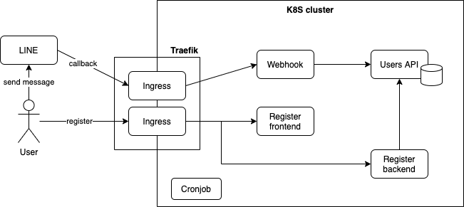

# line-webhook-in-k8s

This project leverages K8S features to run a various-functioned chatbot system, which includes member signup, member authentication, pushing messages to members regularly.

> I wrote a blog post about this project in Chinese, and here is [link](https://disam8853.github.io/chatbot/line-chatbot-in-k8s/).

## Structure

```bash
├── api-users       # RESTful API about members
├── manifest        # K8S resources definition
├── prepare         # KInD and MetalLB and Traefik configuration
├── push-msg        # Push message regularly
├── register-web
|  ├── client       # Register web frontend
|  └── server       # Register web backend
└── webhook         # Handle LINE Webhook events
```

## Tools

1. Kubernetes
3. KInD
2. Traefik
4. Docker
5. (optional) localtunnel (free reverse proxy)

## Flow chart



- User is required to signup through `Register frontend` and `Register backend`
- `Register backend` will store user's information to database through `Users API`.
- User sends message to LINE which sends a webhook event to our `Webhook` service
- `Webhook` handles webook events from LINE and authenticates with `Users API`
- `CronJob` executes pushing messages scripts regularly
